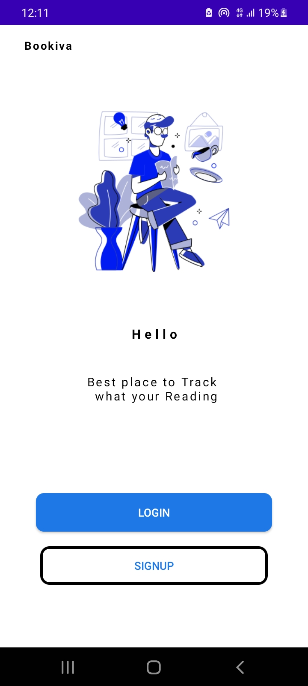
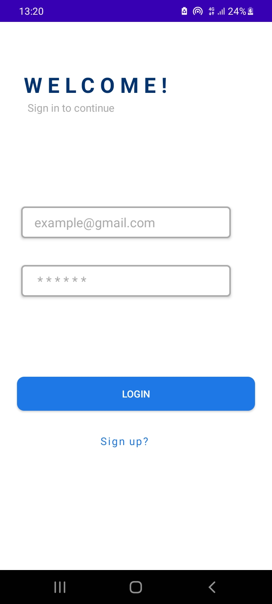
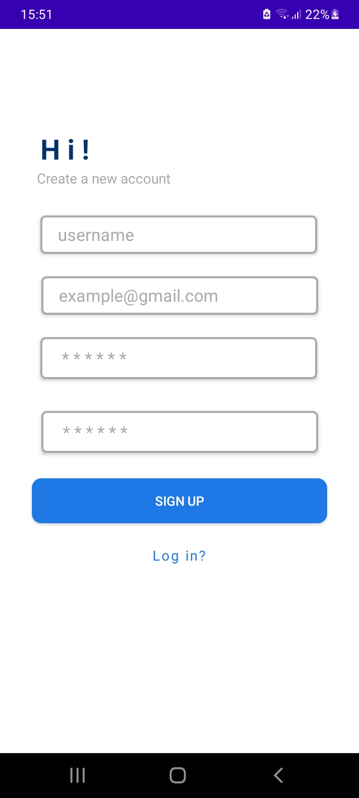

# Bookivia

#### By **Mohamed Ibrahim**

## Description


Bookivia :  Track your Readings, By using Bookiva!

###Screenshoots





## Technologies Used


## Installation
* `git clone <https://github.com/moemaair/Bookiva.git>` this repository
* `cd Bookiva`

### Prerequisites

* Android Smart phone.
* download the app from Playstore.
* Internet Connection i.e WIFI or mobile data.


## download Apk
To download the application check the link below ⬇️
[empty](*)


## Requirements
```bash
      Will be Updated
```

## Known Bugs
- processing power of Api can be slow.


## Contact Details
```bash
You can contact me at rageali12@@gmail.com
```

## License
- This project is licensed under the MIT Open Source license Copyright (c) 2022.

[](https://twitter.com/codingin254)

## Acknowledgments

* Hat tip to anyone whose code was used
* Inspiration
* etc
